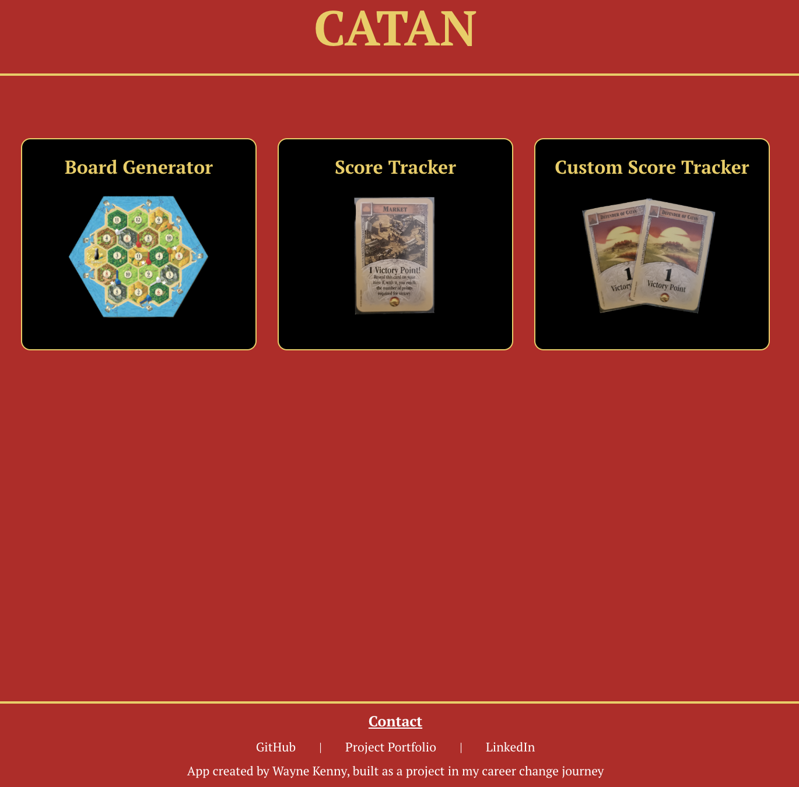
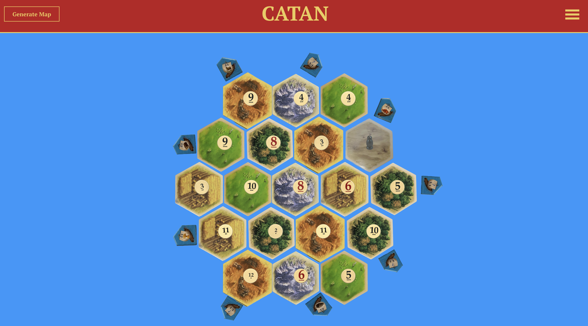
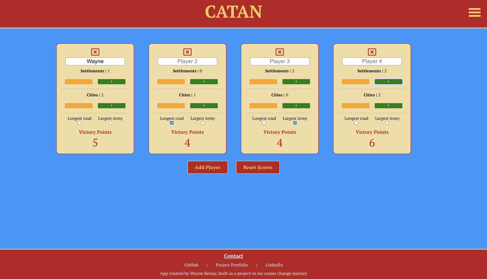
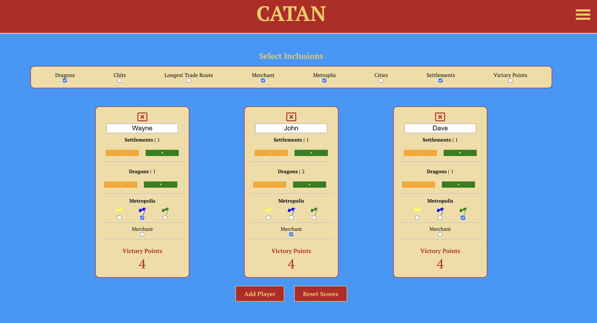

# Catan Board Generator and Score Tracker App
This is a web app for generating random boards for the board game Catan and tracking the score of each player during gameplay.

## Tech 
1. React.JS / JavaScript
2. CSS / Material UI / React-Icons

## Installation
1. Clone the repository to your local machine.
2. Install the necessary dependencies by running npm install.
3. Start the app by running npm start.

## Usage:
Navigate to http://localhost:3000 in your web browser. 
This is what the homepage should look like:  
   

### Board Generator
 
Map-Generator Logic: 
- Shuffle function creates a new array of resources, numbers and ports in a random order.
- Take the index of each item in the three arrays and place them into fixed locations on the board

1. Click the "Generate Board" button to generate a new random board.
2. The board will consist of 19 tiles with random resources and numbers on them, as well as 9 ports with random trade ratios.
3. Click on any tile to see its resource and number.   

### Score Tracker

1. To track the score of a player, keep clicking 'add player' until you have the desired number of players and then add each players name in the input fields.
2. To mark that a player has built a settlement, click the + button under "Settlement" next to their name.
3. To mark that a player has upgraded a settlement to a city, click the + button under "City" next to their name and the - button under "Settlement".
4. To mark that a player has the longest road or largest army, tick the box under the corresponding title.
5. The app will automatically calculate each player's total score, taking into account points from settlements, cities, and any other victory point cards they may have.   

### Custom Score Tracker
 
I built an additional tracker that works in a similar way to the score tracker but can be customised to handle points scoring for the Seafarers, Cities and Knights and Dragons varients of the catan game

1. Use the tick boxes to add what elements are included in your game
2. To mark that a player has achieved one of the following, "Settlement", "City", "Dragons", "Victory Points" and "Chits", click the + button under the corrsponding title next to the players name and vice versa if a player has lost one of these elements
3. To mark that a player has the longest road, merchant or a metropolis, tick the box under the corresponding title next to their name.
4. The app will automatically calculate each player's total score, taking into account points from settlements, cities, dragons, chits, and any other victory point they may have.   

## Future Improvements
1. Add a backend and database to allow players to login and save a game board that they like
2. Update the map-generator logic to ensure the strongest numbers (6 and 8) are not next to each other on the board
3. re-design and format the hex images to acheive a closer alignment on the map board